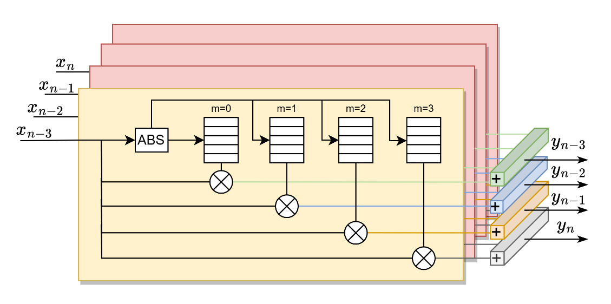

# The hardware implementation of Polyphase Memory Polynomial model
The model have been tested in Xilinx Versal VCK190 and Ultrascale+ ZCU102.

## Introduction
Memory polynomial (MP) model is a well-known model in the area of digital
predistortion (DPD). The memory polynomial (MP) utilizes only the diagonal term
of the complete Volterra series, resulting in a good performance with a small
number of coefficients [Research Paper][1].

## Mathematical principle
The mathematical equation of the memory polynomial model can be expressed as follows.

```math
y_n =\sum_{m=0}^M x_{n-m} \cdot\left(\sum_{k=0}^K a_{k m}\left|x_{n-m}\right|^k\right) \\
    =\sum_{m=0}^M x_{n-m} \cdot h(\left|x_{n-m}\right|)
```

$x$ indicates the input baseband signal, $M$ is the memory depth and
$K$ is the polynomial order. The coefficients $a_{km}$ can be combined
with $|x_{n-m}|^k$, thus put into the lookup tables (LUTs). Therefore,
the content of LUTs is represented by $h(|x_{n-m}|)$.

The Python implementation of coefficients extraction and evaluation are given in
`sw` directory.

## Hardware Implementation
We implement the MP model according to [Altera white paper][2], the hardware implementation of
monophase and polyphse MP model is show below.




We implement a four phase MP model using SystemVerilog, the implementation is
given in `hw` directory. 


[1]: [Digital Predistortion of Wideband Signals Based on Power Amplifier Model with Memory](https://digital-library.theiet.org/content/journals/10.1049/el_20010940)
[2]: [Designing polyphase DPD solutions with 28-nm FPGAs](https://cdrdv2-public.intel.com/650543/wp-01171-polyphase-dpd.pdf)
